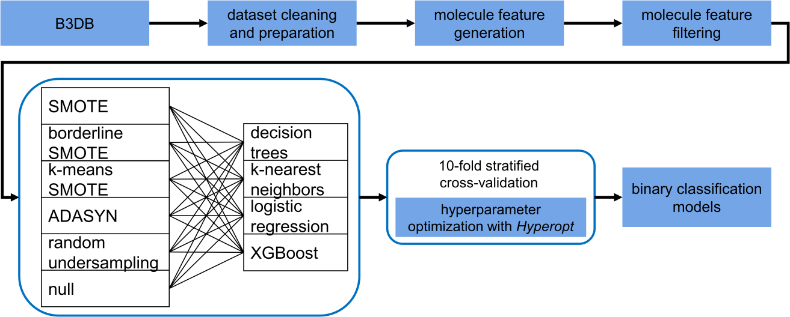

# B3clf

## About

The blood-brain barrier (BBB) provides a well-designed system for protection and regulation of 
microvasculature in the central nervous system (CNS). Specifically, the BBB is responsible for 
the maintenance of homeostatis of the CNS and the protection of the CNS by inhibiting the 
transportation or passage of toxins, pathogens, and inflammations from the blood.
However, because of its resistance of exogenous compounds, the BBB also poses a challenge for the 
delivery of neuroactive molecules (i.e. drugs) into the CNS. It is estimated that 98\% of drugs 
and approximately 100\% of bio-molecular pharmaceuticals 
(such as peptides and monoclonal antibodies) suffer from BBB penetration problems.  
Understanding small molecules' BBB permeability is therefore not only vital for CNS drug discovery, 
but must be considered at an early stage in the drug-development pipeline to avoid costly failures 
drug formulation studies in late-stage.

We used 7407 data from out curated dataset, [B3DB](https://github.com/theochem/B3DB). There are 
24 different models by combining basic form of classification algorithms (_dtree_ for decision 
trees, _logreg_ for logistical regression, _knn_ for KNN, _xgb_ for XGBoost) and resampling 
strategies (_classic_RandUndersampling_, _classic_SMOTE_, _borderline_SMOTE_, _classic_ADASYN_, 
and _common_ for no resapling strategy), as shown below.



The `b3clf` predicts BBB permeability following the design structure,


and it prints out molecule name/ID, predicted probability and BBB 
permeability labels. The predicted probability makes it easy to benchmark out models, enabling 
calculations of ROC, precision-recall curves and _et al_. `b3clf` has been tested on Windows 10, 
Linux and MacOS.

## Installation

It is recommended to work with a virtual environment with `Python >=3.7`. Here are the code 
snip that can be used to install our package.

```bash
# create a virtual environment with conda
conda create -y -n b3clf_py37 python=3.7
conda activate b3clf_py37

# install dependencies
conda install --file requirements.txt
# conda env create --file environment.yml

# download b3clf along with submodules
git clone --recursive  git@github.com:theochem/B3clf.git
cd B3clf
# just double check if submodule is downloaded
git submodule update --init --recursive

# install package
pip install .
```

Last but not least, Java 6+ is required in order to compute chemical descriptors with 
[`Padel`](http://www.yapcwsoft.com/dd/padeldescriptor/). But the user does not need to manually 
download `Padel` as we have added this as a submodule by modifying the implementation of 
[`padelpy`](https://github.com/ecrl/padelpy). For the updated version, please go to
[https://github.com/fwmeng88/padelpy](https://github.com/fwmeng88/padelpy).

## Usage


## Getting Help

Once can easily get the help document from `bash` with
```bash
b3clf --help
```
which prints out,
```
usage: b3clf [-h] [-mol MOL] [-sep SEP] [-clf CLF] [-sampling SAMPLING]
             [-output OUTPUT] [-verbose VERBOSE]
             [-keep_features KEEP_FEATURES] [-keep_sdf KEEP_SDF]

b3clf predicts if molecules can pass blood-brain barrier with resampling
strategies.

optional arguments:
  -h, --help            show this help message and exit
  -mol MOL              Input file with descriptors.
  -sep SEP              Separator for input file.
  -clf CLF              Classification algorithm type.
  -sampling SAMPLING    Resampling method type.
  -output OUTPUT        Name of output file, CSV or XLSX format.
  -verbose VERBOSE      If verbose is not zero, B3clf will print out the
                        predictions.
  -keep_features KEEP_FEATURES
                        To keep computed feature file or not.
  -keep_sdf KEEP_SDF    To keep computed molecular geometries or not.
```

In `Python`, it is also doable with
```python 
from b3clf import b3clf

b3clf?
```

There are two ways of `B3clf` for BBB predictions, as a command-line (CLI) tool or as a Python
package. 

### CLI of `B3clf`

Now `B3clf` supports SMILES and SDF text files where we have provided 3 sampling files at 
[test](test) sub-folder. A quick start is
```bash 
b3clf -mol test_SMILES.csv -clf xgb -sampling classic_ADASYN -output test_SMILES_pred.xlsx -verbose 1
```
and the output is 

|   | ID             | B3clf_predicted_probability | B3clf_predicted_label |
|---|-----------------|------------------------------|------------------------|
| 0 | H1_Bepotastine | 0.142235                    | 0                     |
| 1 | H1_Quifenadine | 0.981108                    | 1                     |
| 2 | H1_Rupatadine  | 0.967724                    | 1                     |

## Citation

Please use the following citation in any publication using our *b3clf* package:

```md
Fanwang Meng, et al, Blood-Brain Barrier Permeability Predictions of
Organic Molecules with XGBoost and Resampling Strategies, Journal, page, volume, year, doi.
```

## Contributing and Q&A

For any suggestions or questions, everyone is welcome to email or post questions in 
[GitHub Discussion Board](https://github.com/theochem/B3clf/discussions).

### _ToDo_

- [ ] Add link to manuscript
- [ ] Add CITATION.cff once manuscript is published
- [ ] Add environment.yml for conda to install everything in one step
